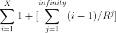
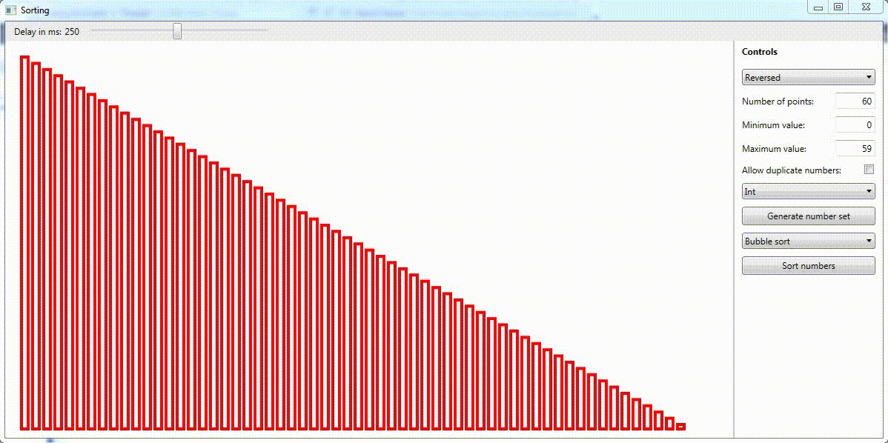
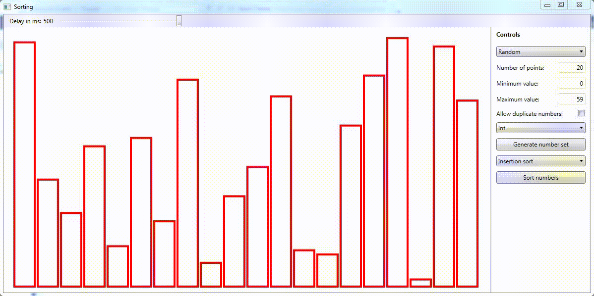
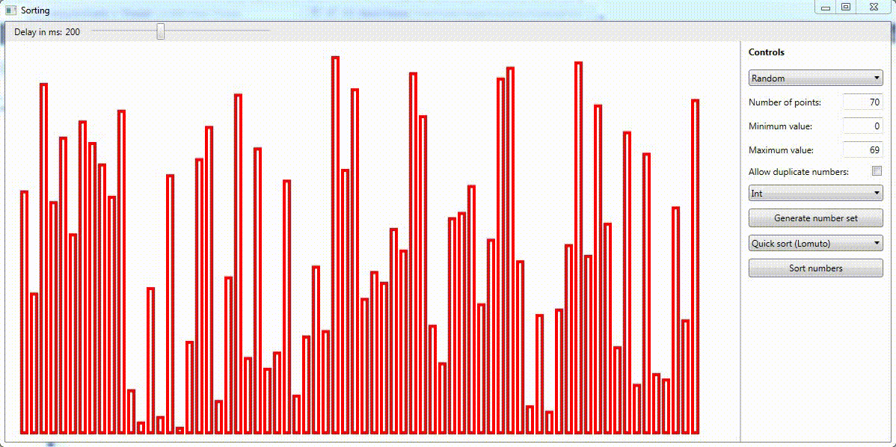
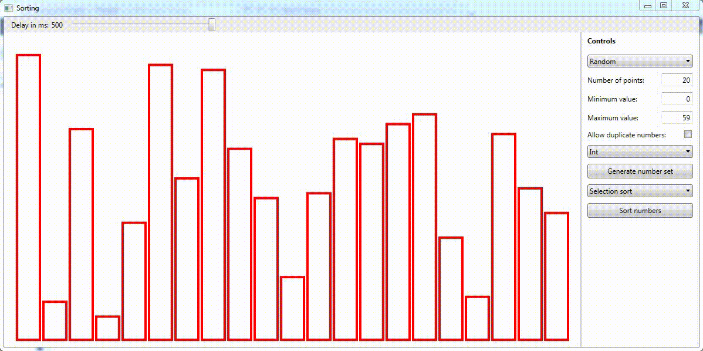

# Sorting Algorithms
 
I have implemented a number of sorting algorithms ([Bubble sort](https://github.com/martijndekker98/PathFinder/blob/884763befa29f17f476588fefd4a826afc1009b9/PathFinder/SortingAlgorithms/BubbleSortBasic.cs), [Insertion sort](https://github.com/martijndekker98/PathFinder/blob/884763befa29f17f476588fefd4a826afc1009b9/PathFinder/SortingAlgorithms/InsertionSort.cs), [Quick sort](https://github.com/martijndekker98/PathFinder/blob/884763befa29f17f476588fefd4a826afc1009b9/PathFinder/SortingAlgorithms/QuickSortLomuto.cs) and [Selection sort](https://github.com/martijndekker98/PathFinder/blob/884763befa29f17f476588fefd4a826afc1009b9/PathFinder/SortingAlgorithms/SelectionSort.cs)) that can sort a list of numbers (this can be extended, but for ease of demonstrating I have chosen to stick with numbers). The numbers are represented by rectangles as this can show the sorting process better than numbers alone. The height of the rectangles is related to the value of the corresponding number where a large rectangle indicates a higher value.  

## Challenges
Implementing this small program presented some challenges, some easy and some more difficult, such as:  
- [Random extension](https://github.com/martijndekker98/PathFinder/blob/884763befa29f17f476588fefd4a826afc1009b9/PathFinder/RandomExtMethods.cs#L16) that can generate random numbers without excluding a single possible value (the standard Random.Next() method generates a number: 
   >    [that is greater than or equal to 0 and less than Int32.MaxValue.](https://docs.microsoft.com/en-us/dotnet/api/system.random.next?view=net-6.0)  

   and thus excludes the MaxValue). Although it is not of grave importance for this program, I have made sure to prevent any modulo bias in the random number generation.
- Implementing the sorting algorithms and a general ["Sorting algorithm"](https://github.com/martijndekker98/PathFinder/blob/884763befa29f17f476588fefd4a826afc1009b9/PathFinder/SortingAlgorithms/BasisSortAlgorithm.cs) class such that sorting the number list does not require the algorithm variable to be cast to the specific algorithm
- [Wrappers for the numbers](https://github.com/martijndekker98/PathFinder/blob/884763befa29f17f476588fefd4a826afc1009b9/PathFinder/DataWrapper.cs), such that the wrapper contains the value (actual number) and the corresponding rectangle. This makes the [swapping/switching](https://github.com/martijndekker98/PathFinder/blob/884763befa29f17f476588fefd4a826afc1009b9/PathFinder/NumberSetNew.cs#L283) of elements easier as the code does not have to find the corresponding rectangle in some different list, switching the two wrappers will immediately take care of switching the two rectangles as well.
 - [Override operators](https://github.com/martijndekker98/PathFinder/blob/884763befa29f17f476588fefd4a826afc1009b9/PathFinder/DataWrapper.cs#L307) such as '>', '<', '>=', '<=' etc. for the wrapper
- A [wrapper for the list of numbers](https://github.com/martijndekker98/PathFinder/blob/884763befa29f17f476588fefd4a826afc1009b9/PathFinder/NumberSetNew.cs#L254) and a virtual/override method for [switching numbers](https://github.com/martijndekker98/PathFinder/blob/884763befa29f17f476588fefd4a826afc1009b9/PathFinder/NumberSetNew.cs#L283)
- Efficiently generating a list of (unique) numbers. Generating a list of numbers, with duplicates allowed, is not so difficult, as the Random.Next() or a random extension method can be used X times to generate X numbers. But if all the numbers have to be unique it becomes less straightforward. There are two methods that I have used for generating unique numbers:
  1. [Generate a random number](https://github.com/martijndekker98/PathFinder/blob/884763befa29f17f476588fefd4a826afc1009b9/PathFinder/GenerateRandomSet.cs#L184), add it to a HashSet (a list could be used as well, but would be slower) to keep track of generated numbers. Continue this process till there are enough numbers in the HashSet. Adding a duplicate number to the HashSet is not a problem, because it is a set there will not be any duplicates in the HashSet.
  2. [Iterate over all the allowed numbers](https://github.com/martijndekker98/PathFinder/blob/884763befa29f17f476588fefd4a826afc1009b9/PathFinder/GenerateRandomSet.cs#195) (with a for loop), compute the probability of selecting the number which is '# numbers to generate' / '# numbers in the range' (so 5 numbers from the inclusive range (0, 9) results in a probability of 0.5). Then for each iteration, generate a random floating point number and if it is smaller than the probability, the number corresponding to the current iteration is added to a list. The method stops prematurely if enough numbers have been added to the list but it has not iterated over all possibilities. The method will also add all remaining numbers if the number of iterations left is equal to the number of numbers that it still needs to add.  

  Both these methods have their own strength but also come with some problems. Here are two (extreme) cases to illustrate the problem:
   - X (e.g. 1,000,000) unique numbers need to be generated within the (inclusive) range of (A, B), or (0, 1,000,001). It would be possible to use method 1, but then there is a chance that, for the last few numbers, the program has to generate an enormous amount of random numbers to find a number not yet in the HashSet. For the last (millionth number) the probability that it generates a number that is absent in the HashSet is only 3/1,000,0001 = 0.0000003
   - X (e.g. 1,000,000) unique numbers need to be generated within the (inclusive) range of Int32 or (-2,147,483,648;  2,147,483,647). Using the second method would take 4,294,967,295 iterations, while generating a random floating point in each iteration. This would take a very long time and thus, it is not a viable option. Here the first method would require approximately 1,000,116 random numbers to be generated before all 1,000,000 unique numbers have been generated. 

  The equation to compute the expected number of random number generation calls required, for the first method, is (X = # numbers to generate, R = numbers in range): 

After some testing I have found that if the order of the numbers does not matter, the ratio of '# numbers in the range' to '# numbers to generate' needs to be >= 7.0 to make the first method faster. If, however, the order does matter this ratio goes up to around 11. This is because with the second method the numbers are already in the correct order (sorted or reversed) but with the first method the numbers in the HashSet still need to be sorted to get the desired order.

## Demo of the algorithms
### Bubble sort:  
  

### Insertion sort:  
  

### Quick sort:  
  

### Selection sort:  
  
